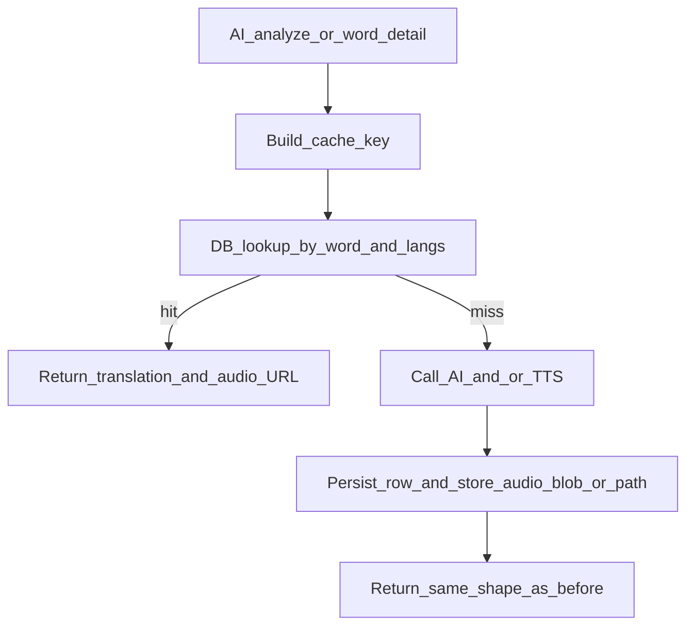

# Backend cache plan (translation + audio)

See [Migration overview](./00-overview.md) for how this document fits the full roadmap.

Part of the native iOS migration split. Related docs: [02-ios-mvp-local-first](./02-ios-mvp-local-first.md), [03-auth-and-guest-mode](./03-auth-and-guest-mode.md), [04-sync-and-account-migration](./04-sync-and-account-migration.md).

## Goal

Reduce AI/TTS cost and latency for **all** API clients by persisting successful translation + TTS results in a **shared server cache**. Repeat requests with the same normalized text and language pair are served from the database **without** calling OpenAI/TTS, returning the same response shape and a stable (or regenerable) audio resource reference.

## Scope

- `translation_cache` (or equivalent) persistence and lookup
- Server-side audio storage (disk / S3 / Blob per infrastructure) + metadata in DB
- AI pipeline integration: lookup **before** OpenAI/TTS; persist on success
- OpenAPI: **additive** changes only; **backward-compatible** response fields for existing clients
- Metrics: `translation_cache_hit` / `translation_cache_miss` (optional TTS miss)

Out of scope for **this** document: SwiftUI, SQLite on device, sync, guest JWT issuance (see Plan 03 for guest policy flags that may disable cache for guests).

## Cache key (minimum)

- Normalized source word or phrase + `source_language` + `target_language`.

## Normalization (must match all clients)

Single rule on server and clients (iOS, web, Capacitor):

- **Text:** Unicode NFC, `trim`, lowercasing per a **fixed** choice: either locale-aware for the source language, or stable lowercasing without locale if languages are restricted (e.g. Latin-only). Document the choice when implementing.
- **Languages:** One format in DB and API (e.g. BCP-47 subset or internal codes from `contracts/openapi/openapi.yaml`). **Identical strings** in the composite key everywhere.

## Data model (concept)

Table such as **`translation_cache`** with at least:

- Languages and normalized key (or composite unique constraint)
- Translation payload: JSON column and/or normalized columns
- `audio_storage_key` / `audio_url` (or equivalent)
- `created_at`, optional `last_hit_at` for analytics
- Consider a **version** or **prompt/model hash** field for invalidation when AI behavior changes

## Server flow

## Integration points (`apps/api-dotnet`)

- Wire into AI entrypoints (e.g. `analyze-word`, `word-detail`, and if applicable `extract-words`).
- Before OpenAI: `TryGet`; on miss call AI/TTS; on success `Save` translation + audio pointer.
- Services such as `OpenAiJsonService` (or equivalent) participate in this ordering.

## OpenAPI

- Update `contracts/openapi/openapi.yaml` only if the contract changes.
- Preserve backward compatibility of response fields for web/Capacitor and native clients.

## Observability

- Backend logs/metrics: **`translation_cache_hit`**, **`translation_cache_miss`** (and optionally TTS miss) on relevant endpoints so acceptance does not depend on reading raw OpenAI logs.

## Guest and shared cache (server/product)

- Writes to the shared cache from **guest-originated** translation are allowed in the product model (not the personal user dictionary).
- Privacy Policy should mention phrase aggregation/caching for cost savings.
- Under strict GDPR, the product may add a **server flag to disable persistence for guest**—implemented here, coordinated with [03-auth-and-guest-mode](./03-auth-and-guest-mode.md).

## Client strategy (reference)

- Native app in `apps/ios-native` stays local-first; on local miss it calls the API; the server often answers from DB without AI.
- **`apps/web-react`** and an optional **Capacitor**-packaged client remain **separate** apps using the **same API**; duplication of business rules is minimized via **OpenAPI** and **identical cache-key rules** with the web app.

## Implementation checklist

- EF Core entities + migrations for `translation_cache` (+ audio metadata tables if split).
- `TranslationCacheService`: `TryGetAsync(normalizedWord, sourceLang, targetLang)`, `SaveAsync(...)`.
- Cache-first in AI pipelines; persist on success.
- Metrics for acceptance tests.
- Optional: background cleanup of stale audio or storage size limits.

## Dependencies

**Depends on**

- Stable shape of AI responses (what to store and return).
- Written agreement on normalization and language codes (shared with iOS MVP).

**Depended on by**

- iOS MVP and web: fewer AI calls; predictable “duplicate word” behavior.
- Auth/guest plan: quotas for guest AI; optional “no server cache for guest.”

## Done criteria

- Migrations applied; responses match **pre-cache** field compatibility.
- Second identical request (normalized word + langs) does **not** invoke OpenAI/TTS (verified via **metrics** or integration tests).
- Hit/miss metrics observable for AI endpoints.
- No breaking changes to existing OpenAPI response fields for current clients.
