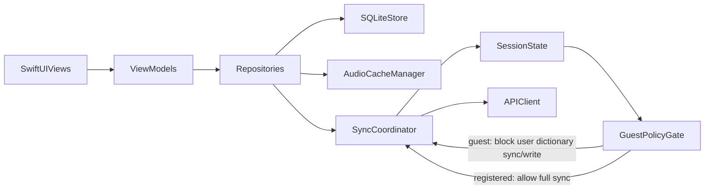

# Auth and guest mode plan

See [Migration overview](./00-overview.md) for how this document fits the full roadmap.

Part of the native iOS migration split. Related docs: [01-backend-cache-plan](./01-backend-cache-plan.md), [02-ios-mvp-local-first](./02-ios-mvp-local-first.md), [04-sync-and-account-migration](./04-sync-and-account-migration.md).

## Goal

Provide **registered** authentication (email/password and provider flows supported by the backend) and an optional **guest** path that can call protected AI endpoints **without** opening expensive endpoints as anonymous. Guest must **not** sync or write the **user dictionary** to the server. Enforcement is **both** client-side (`GuestPolicyGate`, `SessionState`) and server-side (claims, quotas, write guards).

## Scope

- **Guest JWT:** short-lived token, same `Authorization: Bearer` shape as registered JWT; claims such as `guest: true` and a distinct `sub` for the anonymous session.
- Issuance: dedicated endpoint on `AuthController` (or equivalent) in `apps/api-dotnet`.
- **Registered auth:** email/password + **Sign in with Apple** + **Google** as supported by the backend; store JWT in **Keychain**.
- **`SessionState`:** reflects guest vs registered, user identifiers, token lifecycle.
- **`GuestPolicyGate`:** central client policy—block user-dictionary **sync** and **server writes** for guest; allow permitted read-only and AI calls within guest JWT and quotas.
- **Quotas:** server-enforced **rate limit** and **daily limit** (and any additional dimensions product requires) for guest.
- **Privacy:** Privacy Policy updates for guest JWT, phrase caching ([01-backend-cache-plan](./01-backend-cache-plan.md)), and cache/analytics metrics if collected.
- **UI:** Continue as Guest / Register / Login; guest mode indicates **local-only personal dictionary on server** (no cloud vocabulary sync for guest).

## Problem (context)

In `apps/api-dotnet`, controllers such as `AiController`, `WordsController`, and `SyncController` use **`[Authorize]`**. Without a JWT, AI calls fail—so guest needs a **token** (or an explicit product decision to avoid server AI for guests).

## Default decision

- **Continue as Guest** obtains a **short-lived guest JWT**.
- AI endpoints remain **authorized**; no `[AllowAnonymous]` on expensive routes.
- **Shared translation cache** on the server is **not** the personal dictionary—only normalized (word, source_lang, target_lang) + translation/audio metadata ([01-backend-cache-plan](./01-backend-cache-plan.md)).

## Forbidden for guest

- Pushing the **user dictionary** (words/collections owned by the user) to the server.
- **Sync** of user-owned entities.
- Any **writes** to user-owned tables that registered users may use—enforce with `GuestPolicyGate` on the client and **role/claim checks** on the server for writes.

## Alternative (product)

- Fully **local TTS** for guest (e.g. `AVSpeechSynthesizer`) **without** server AI—use if server translation for guests is disallowed.

## Full target architecture (with sync—sync details in Plan 04)

This plan owns **`SessionState`**, **`GuestPolicyGate`**, JWT issuance, and quotas. **`SyncCoordinator`** behavior is specified in [04-sync-and-account-migration](./04-sync-and-account-migration.md).

## Repository interaction

- **`WordRepository`:** remains local-first; for new words, network calls use JWT (**registered or guest**) per product rules.
- **`GuestPolicyGate`:** gates sync and server writes for user vocabulary; allows permitted AI usage under guest JWT within quotas.

### Camera / batch flows (guest)

When **Camera AI** (or similar batch flows) runs as **guest**: use the network **only** where **translation or word detail** is required; **do not** push the **user dictionary** or user-owned collections to the server. Same rule as manual add-word: **local-first** for data that belongs to the user’s vocabulary on device until they register and [04-sync-and-account-migration](./04-sync-and-account-migration.md) applies.

## Guest and server cache

- Server may persist guest-originated translations into the **shared** cache unless a product flag disables it ([01-backend-cache-plan](./01-backend-cache-plan.md)).

## Implementation notes

- Wire onboarding in `apps/ios-native` (e.g. `Features/Onboarding/FirstLaunchAuthView.swift`) to real endpoints: `POST /api/auth/apple`, `POST /api/auth/google`, etc., per `docs/ios-native.md` and OpenAPI.
- After OAuth or login, store JWT in Keychain and refresh `SessionState`.

## Dependencies

**Depends on**

- Backend endpoints for login, providers, and **guest token** issuance.
- [02-ios-mvp-local-first](./02-ios-mvp-local-first.md) for stable `WordRepository` and local model (recommended before full guest integration testing).

**Depended on by**

- [04-sync-and-account-migration](./04-sync-and-account-migration.md) for distinguishing guest vs registered during sync and migration.

## Risks

- **Abuse / cost:** guest JWT enables server AI—**quotas must be server-enforced**, not UI-only.
- **Token theft / replay:** short TTL, minimal claims, TLS; consider rotation or binding strategy.
- **Authorization bugs:** guest must not successfully call **write** or **sync** for user data—**server must deny** even if the client regresses.
- **Privacy / compliance:** shared cache may store phrases from guests—document and optionally disable server cache for guest ([01-backend-cache-plan](./01-backend-cache-plan.md)).
- **Identity:** guest `sub` must **not** leak into registered user-owned rows without explicit account linking ([04-sync-and-account-migration](./04-sync-and-account-migration.md)).

## Done criteria

- **App Store / compliance:** Privacy Policy (and any App Store privacy details) updated when shipping **guest JWT**, **server phrase caching** ([01-backend-cache-plan](./01-backend-cache-plan.md)), and **cache hit/miss** or related analytics if those metrics are user-visible or collected as personal data.
- Registered flows work end-to-end; JWT stored in Keychain; logout clears secrets; session reflects registered user.
- Guest: guest JWT issuance works; AI calls succeed **only** with valid guest token and within **quotas**; documented **403/429** behavior and tests.
- **No** server sync of personal dictionary from guest; **no** user-dictionary writes on server for guest (verified by tests).
- **`GuestPolicyGate`** centralizes client policy; server rejects forbidden operations.
- Privacy Policy updated if shipping guest JWT, phrase caching, and related analytics.
